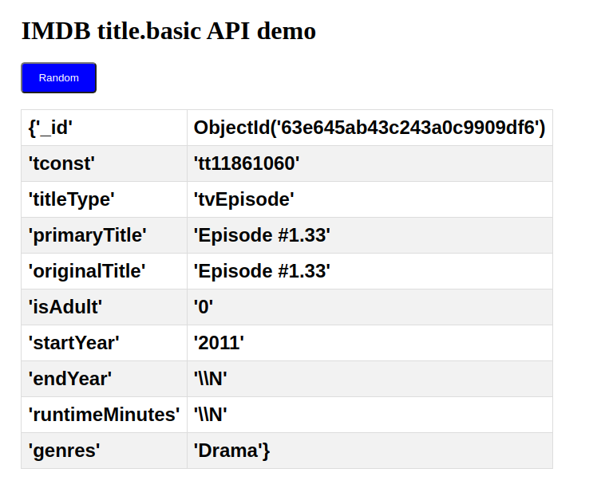

# IMDB database project

This project is a database project for the IMDB database. The database is a relational database and is hosted on a MongoDB server.
Project has a REST API for the database. The API will be written in Python and will be made with FastAPI.
This project uses docker to run the database and the API.

# IMDB data

you can download the data from [here](https://datasets.imdbws.com/)
The data is in a .tsv format and is tab separated. The data is in a .gz format and needs to be unzipped.

# commands

## docker

### build

```bash
docker-compose build
```

### run

```bash
docker-compose up
```

### stop

```bash
docker-compose down
```

# screenshots

